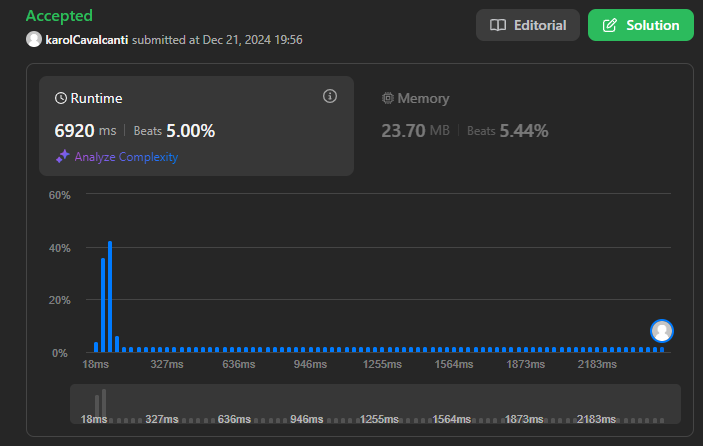

# LeetCode Problems

**Número da Lista**: 26 
**Conteúdo da Disciplina**: Dividir e Conquistar 

## Alunos
|Matrícula | Aluno |
| -- | -- |
| 211031575  | Ana Karoliny de Souza Cavalcanti |
| 211031056 | Guilherme de Sá Gonçalves |

## Sobre 
Esse projeto tem como objetivo armazenar as resoluções feitas dos seguintes exercícios do LeetCode:
 - (Medium) - [#973. K Closest Points to Origin](https://leetcode.com/problems/k-closest-points-to-origin/description/?envType=problem-list-v2&envId=divide-and-conquer)
 - (Hard) - [#493. Reverse Pairs](https://leetcode.com/problems/reverse-pairs/description/?envType=problem-list-v2&envId=divide-and-conquer) 
 - (Hard) - #000

## Screenshots
#973. K Closest Points to Origin

#493. Reverse Pairs

## Instalação 
**Linguagem**: Python 3 
No caso, basta fazer uma conta no LeetCode, e ir no problema e copiar o código na resolução e testar.

## Uso 
Porém caso não queira testar pelo LeetCode, basta clonar o repositório e rodar o arquivo com o nome do número do exercício, foram setados os mesmos exemplos de inputs que constam na descrição do problema.

## Outros 
Copiamos os problemas para o repositório, caso não queria abrir o LeetCode e queira ler a descrição do problema, clique [AQUI!!!](Problems.md)

